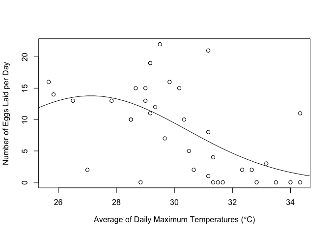

Effects of generation and increased temperature on Appalachian Brown Egg Survival, Larval Survival and Fecundity
================
Elsita Kiekebusch
8/30/2019

This is an abbreviated document that displays the vital rate fits ONLY for Appalachian Brown egg survival, larval survival and fecundity.

For egg and larval survival, "Maximum Temperature + Flight Period" (Generation) was determined by AICc ranking to be the best model. I show the overall model fits (eg summary(model)) and then demonstrate how I extracted each generational model fit (summer 1, summer 2, winter).

For fecundity, "Maximum Temperature Squared" was determined by AICc ranking to be the best model fit for number of Eggs Laid PER DAY. To proceed with (any) population model, total fecundity can be estimated by multiplying the daily fecundity (from model fit) with the average adult lifespan estimated from mark recapture (Lifespan = 1/ (1-daily adult survival) = 1/ 1-0.91 = 11.1). I capped the total number of eggs laid at 116.914/2 = 58.457 (half of total possible eggs found by Sivakoff et al 2016). Fecundity warming experiments and mark recapture were carried out during a single time period, therefore IT MUST BE ASSUMED THAT FECUNDITY AND ADULT LIFESPAN WERE CONSTANT DURING ALL GENERATIONS.

Effects of Increased Temperatures on Egg Survival
=================================================

Getting the Data
----------------

``` r
#read in the data
Data1=read.csv("Warming.Field.FP4.5.Eggs.Results.1.8.18.csv")
Data2=read.csv("Warming.Field.FP2.3.Eggs.Results.1.8.18.csv")
Data3=read.csv("Warming.Field.FP3.1.Eggs.Results.1.8.18.csv")

Data1$FP <- "A" #summer 1 generation
Data2$FP <- "B" #summer 2 generation
Data3$FP <- "C" #winter generation

Data4 <- rbind(Data1, Data2)
Data <-rbind(Data4,Data3)

#change data into egg counts from 1 day survival
Data$dailySurvival <- sqrt(Data$TwoDaySurvival)
Data$Eggs.OutA <- round(Data$dailySurvival*Data$Eggs.In)

#add Dam Restoration treatment
Metadata=read.csv("Restoration.DAM.Treatments.csv")
Data <- merge(Data,Metadata,by=c("Site","Plot"))
#str(Data)

#create survival variable
survariable <- cbind(Data$Eggs.OutA, Data$Eggs.In-Data$Eggs.OutA)
```

EGG SURVIVAL - Highest Ranked Model
-----------------------------------

``` r
#model converges without scaling
maxTemp.mod = glmer(formula = survariable ~ AVEmaxTemp + FP + (1 | Site/Plot), data = Data, family = binomial(logit))
summary(maxTemp.mod)
```

    ## Generalized linear mixed model fit by maximum likelihood (Laplace
    ##   Approximation) [glmerMod]
    ##  Family: binomial  ( logit )
    ## Formula: survariable ~ AVEmaxTemp + FP + (1 | Site/Plot)
    ##    Data: Data
    ## 
    ##      AIC      BIC   logLik deviance df.resid 
    ##    201.9    215.0    -95.0    189.9       59 
    ## 
    ## Scaled residuals: 
    ##     Min      1Q  Median      3Q     Max 
    ## -4.1414 -0.7807  0.1136  0.7985  1.6181 
    ## 
    ## Random effects:
    ##  Groups    Name        Variance Std.Dev.
    ##  Plot:Site (Intercept) 0.10086  0.3176  
    ##  Site      (Intercept) 0.08217  0.2867  
    ## Number of obs: 65, groups:  Plot:Site, 9; Site, 3
    ## 
    ## Fixed effects:
    ##             Estimate Std. Error z value Pr(>|z|)    
    ## (Intercept)  5.59046    1.69397   3.300 0.000966 ***
    ## AVEmaxTemp  -0.10448    0.05813  -1.797 0.072266 .  
    ## FPB         -0.04658    0.37043  -0.126 0.899945    
    ## FPC          0.62156    0.36020   1.726 0.084420 .  
    ## ---
    ## Signif. codes:  0 '***' 0.001 '**' 0.01 '*' 0.05 '.' 0.1 ' ' 1
    ## 
    ## Correlation of Fixed Effects:
    ##            (Intr) AVEmxT FPB   
    ## AVEmaxTemp -0.980              
    ## FPB         0.319 -0.452       
    ## FPC         0.067 -0.190  0.667

``` r
#get coefficients
#not sure what to do with multiple random effect values
betas.Egg <- coef(maxTemp.mod) 
betas.Egg
```

    ## $`Plot:Site`
    ##       (Intercept) AVEmaxTemp         FPB      FPC
    ## B:D3S    5.627006 -0.1044841 -0.04657519 0.621562
    ## C:M2     5.361068 -0.1044841 -0.04657519 0.621562
    ## D:D3S    5.646476 -0.1044841 -0.04657519 0.621562
    ## D:M2     5.934614 -0.1044841 -0.04657519 0.621562
    ## E:D3S    5.671440 -0.1044841 -0.04657519 0.621562
    ## E:M2     5.626523 -0.1044841 -0.04657519 0.621562
    ## F:D3N    5.512005 -0.1044841 -0.04657519 0.621562
    ## G:D3N    5.667533 -0.1044841 -0.04657519 0.621562
    ## I:D3N    5.214086 -0.1044841 -0.04657519 0.621562
    ## 
    ## $Site
    ##     (Intercept) AVEmaxTemp         FPB      FPC
    ## D3S    5.731845 -0.1044841 -0.04657519 0.621562
    ## M2     5.713338 -0.1044841 -0.04657519 0.621562
    ## D3N    5.282699 -0.1044841 -0.04657519 0.621562
    ## 
    ## attr(,"class")
    ## [1] "coef.mer"

``` r
fixef.Egg<- fixef(maxTemp.mod)
fixef.Egg
```

    ## (Intercept)  AVEmaxTemp         FPB         FPC 
    ##  5.59046027 -0.10448415 -0.04657519  0.62156203

``` r
#save coefficients
b0 <- fixef.Egg[1]
X1 <- fixef.Egg[2]
summer2 <- fixef.Egg[3]
winter <- fixef.Egg[4]

#x axis range
X.range <- seq(from=min(Data$AVEmaxTemp), to=max(Data$AVEmaxTemp), by=.01)

#formula set up
s1.logits <- b0 + (X1*X.range) 
s2.logits <- b0 + (X1*X.range) + summer2
w.logits <-  b0 + (X1*X.range) + winter

#apply logit function
summer1 <- exp(s1.logits)/(1 + exp(s1.logits))
summer2 <- exp(s2.logits)/(1 + exp(s2.logits))
winter <- exp(w.logits)/(1 + exp(w.logits))

#PLOT
Data$FP <- factor(Data$FP) #set as factor to color points separately
plot(dailySurvival ~ AVEmaxTemp, data=Data, ylim = c(0.5,1), ylab="Egg Daily Survival", xlab=expression(paste("Average of Daily Maximum Temperatures (" * degree, "C)")), pch=21, bg = c("green", "blue", "red")[unclass(Data$FP)])
lines(summer1~X.range, type="l", lty=1, col="green") #summer 1
lines(summer2~X.range, type="l", lty=1, col="blue") #summer 2
lines(winter~X.range, type="l", lty=1, col="red") #winter
legend("bottomleft", c("Summer 1","Summer 2","Winter"),
       pch=c(NA,NA,NA), col=c("green","blue","red"), lty=c(1,1,1), merge=TRUE, cex=0.7)
```


Effects of Increased Temperatures on Larval Survival
====================================================

Getting the Data
----------------

``` r
#read in the data
Data1=read.csv("Warming.Field.FP4.5.Larvae.Results.1.8.18.csv")
Data2=read.csv("Warming.Field.FP2.3.Larvae.Results.1.8.18.csv")
Data3=read.csv("Warming.Field.FP3.1.Larvae.Results.1.8.18.csv")

Data1$FP <- "A"
Data2$FP <- "B"
Data3$FP <- "C"

Data4 <- rbind(Data1, Data2)
Data <-rbind(Data4,Data3)

#add Dam Restoration treatment
Metadata=read.csv("Restoration.DAM.Treatments.csv")
Data <- merge(Data,Metadata,by=c("Site","Plot"))
#str(Data)

#create survival variable
survariable <- cbind(Data$Larvae.Out, Data$Larvae.In-Data$Larvae.Out)
```

LARVAL SURVIVAL - Highest Ranked Model
--------------------------------------

``` r
#model converges without scaling
maxTemp.mod2 = glmer(formula = survariable ~ AVEmaxTemp + FP + (1 | Site/Plot), data = Data, family = binomial(logit))
summary(maxTemp.mod2)
```

    ## Generalized linear mixed model fit by maximum likelihood (Laplace
    ##   Approximation) [glmerMod]
    ##  Family: binomial  ( logit )
    ## Formula: survariable ~ AVEmaxTemp + FP + (1 | Site/Plot)
    ##    Data: Data
    ## 
    ##      AIC      BIC   logLik deviance df.resid 
    ##    256.4    268.3   -122.2    244.4       48 
    ## 
    ## Scaled residuals: 
    ##     Min      1Q  Median      3Q     Max 
    ## -2.2555 -0.9264 -0.5905  0.7707  6.0381 
    ## 
    ## Random effects:
    ##  Groups    Name        Variance Std.Dev.
    ##  Plot:Site (Intercept) 0.15481  0.3935  
    ##  Site      (Intercept) 0.04738  0.2177  
    ## Number of obs: 54, groups:  Plot:Site, 9; Site, 3
    ## 
    ## Fixed effects:
    ##             Estimate Std. Error z value Pr(>|z|)    
    ## (Intercept) 13.09278    2.97316   4.404 1.06e-05 ***
    ## AVEmaxTemp  -0.48594    0.09446  -5.145 2.68e-07 ***
    ## FPB          0.28317    0.43592   0.650    0.516    
    ## FPC         -4.62652    1.10572  -4.184 2.86e-05 ***
    ## ---
    ## Signif. codes:  0 '***' 0.001 '**' 0.01 '*' 0.05 '.' 0.1 ' ' 1
    ## 
    ## Correlation of Fixed Effects:
    ##            (Intr) AVEmxT FPB   
    ## AVEmaxTemp -0.990              
    ## FPB        -0.112  0.000       
    ## FPC        -0.966  0.937  0.264

``` r
#get coefficients
betas.Larv <- coef(maxTemp.mod2) #not sure what to do with multiple random effect values
betas.Larv
```

    ## $`Plot:Site`
    ##       (Intercept) AVEmaxTemp       FPB       FPC
    ## B:D3S    12.94340  -0.485944 0.2831726 -4.626519
    ## C:M2     12.85317  -0.485944 0.2831726 -4.626519
    ## D:D3S    13.18597  -0.485944 0.2831726 -4.626519
    ## D:M2     13.16673  -0.485944 0.2831726 -4.626519
    ## E:D3S    13.30142  -0.485944 0.2831726 -4.626519
    ## E:M2     13.68583  -0.485944 0.2831726 -4.626519
    ## F:D3N    12.85880  -0.485944 0.2831726 -4.626519
    ## G:D3N    12.83970  -0.485944 0.2831726 -4.626519
    ## I:D3N    13.07443  -0.485944 0.2831726 -4.626519
    ## 
    ## $Site
    ##     (Intercept) AVEmaxTemp       FPB       FPC
    ## D3S    13.13943  -0.485944 0.2831726 -4.626519
    ## M2     13.22357  -0.485944 0.2831726 -4.626519
    ## D3N    12.93812  -0.485944 0.2831726 -4.626519
    ## 
    ## attr(,"class")
    ## [1] "coef.mer"

``` r
fixef.Larv<- fixef(maxTemp.mod2)
fixef.Larv
```

    ## (Intercept)  AVEmaxTemp         FPB         FPC 
    ##  13.0927763  -0.4859440   0.2831726  -4.6265185

``` r
#save coefficients
b0 <- fixef.Larv[1]
X1 <- fixef.Larv[2]
summer2 <- fixef.Larv[3]
winter <- fixef.Larv[4]

#x axis range
X.range <- seq(from=min(Data$AVEmaxTemp), to=max(Data$AVEmaxTemp), by=.01)

#formula set up
s1.logits <- b0 + (X1*X.range) 
s2.logits <- b0 + (X1*X.range) + summer2
w.logits <-  b0 + (X1*X.range) + winter

#apply logit function
summer1 <- exp(s1.logits)/(1 + exp(s1.logits))
summer2 <- exp(s2.logits)/(1 + exp(s2.logits))
winter <- exp(w.logits)/(1 + exp(w.logits))

#PLOT
Data$FP <- factor(Data$FP) #set as factor to color points separately
plot(perEmerged ~ AVEmaxTemp, data=Data, ylim = c(0,1), ylab="Larval Survival", xlab=expression(paste("Average of Daily Maximum Temperatures (" * degree, "C)")), pch=21, bg = c("green", "blue", "red")[unclass(Data$FP)])
lines(summer1~X.range, type="l", lty=1, col="green") #summer 1
lines(summer2~X.range, type="l", lty=1, col="blue") #summer 2
lines(winter~X.range, type="l", lty=1, col="red") #winter
legend("topright", c("Summer 1","Summer 2","Winter"),
       pch=c(NA,NA,NA), col=c("green","blue","red"), lty=c(1,1,1), merge=TRUE, cex=0.7)
```


Effects of Increased Temperatures on Fecundity
==============================================

Getting Data
------------

``` r
data <- read.csv('Fecundity_iButtonData_Results.24HR_Scaled.csv',stringsAsFactors=FALSE)
#str(data)
```

FECUNDITY - Highest Ranked Model
--------------------------------

``` r
maxTemp.sq.mod <- glm(Eggs.Scale ~ AVEmaxTemp + I(AVEmaxTemp^2), family=quasipoisson, data=data)
summary(maxTemp.sq.mod)
```

    ## 
    ## Call:
    ## glm(formula = Eggs.Scale ~ AVEmaxTemp + I(AVEmaxTemp^2), family = quasipoisson, 
    ##     data = data)
    ## 
    ## Deviance Residuals: 
    ##     Min       1Q   Median       3Q      Max  
    ## -4.9105  -1.7805  -0.1500   0.7265   5.2820  
    ## 
    ## Coefficients:
    ##                  Estimate Std. Error t value Pr(>|t|)
    ## (Intercept)     -30.98196   24.31430  -1.274    0.211
    ## AVEmaxTemp        2.47835    1.66169   1.491    0.145
    ## I(AVEmaxTemp^2)  -0.04569    0.02834  -1.613    0.116
    ## 
    ## (Dispersion parameter for quasipoisson family taken to be 5.931211)
    ## 
    ##     Null deviance: 267.30  on 36  degrees of freedom
    ## Residual deviance: 186.01  on 34  degrees of freedom
    ## AIC: NA
    ## 
    ## Number of Fisher Scoring iterations: 6

``` r
#get model coefficients
betas <- coef(maxTemp.sq.mod)
betas
```

    ##     (Intercept)      AVEmaxTemp I(AVEmaxTemp^2) 
    ##    -30.98195565      2.47834554     -0.04569304

``` r
b0 <- betas[1]
b1 <- betas[2]
b2 <- betas[3]

p <- seq(24,38,0.25)
y <- exp(b0 + (b1*p) + (b2*p*p))
#y <- exp((-0.04569*p*p) + (2.47835*p) - 30.98196)

plot(Eggs.Scale ~ AVEmaxTemp, data=data, xlab=expression(paste("Average of Daily Maximum Temperatures (" * degree, "C)")), ylab="Number of Eggs Laid per Day")
lines(y~p, type="l", lty=1) #quadratic
```


